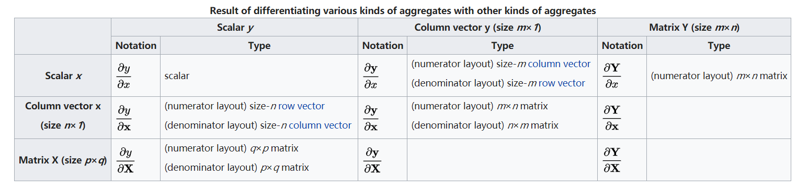

复习一下高数的内容，对于 $n$ 个自变量的函数 $f(x_1, \ldots, x_n)$ ，在点 $(a_1, \ldots, a_n)$ 处函数 $f$ 对变量 $x_i$ 的偏导为: 
$$
\cfrac {\partial f} {\partial x_i}(a_1, \ldots, a_n) = \lim_{h \to 0} \cfrac {f(a_1, \ldots, a_i + h, \ldots, a_n) - f(a_1, \ldots, a_i + h, \ldots, a_n)}{h}
$$

矩阵偏导 (matrix derivative) 是 矩阵分析 (matrix calculus) 的一部分，引用维基百科的解释: 

Matrix calculus (矩阵分析) refers to a number of different notations that use matrices and vectors to collect the derivatives of each components of the dependent variable (因变量) with respect to each component of the independent variable (自变量). In general, the independent variable can be a scalar, a vector or a matrix while the dependent variable can be any of these as well.  

举个例子，如果一个标量函数有三个自变量，即 $f(x_1, x_2, x_3)$ ，那么梯度向量可以表示为: 
$$
\nabla f = \cfrac {\partial f}{\partial x_1} \hat x_1 + \cfrac {\partial f}{\partial x_2} \hat x_2 + \cfrac {\partial f}{\partial x_3} \hat x_3
$$
这里 $\hat x_i$ 表示沿着 $x_i$ 方向的单元向量 (unit vector)，$1 \le i \le 3$ 

这里梯度也可以视为标量 $f$ 相对于向量 $\mathbf {x}$ 的梯度，因此结果也可以表示为向量形式: 
$$
\nabla f = \cfrac {\partial f}{\partial \mathbf {x}} = 
\begin {bmatrix}
\cfrac {\partial f}{\partial x_1} & 
\cfrac {\partial f}{\partial x_2} & 
\cfrac {\partial f}{\partial x_3}
\end {bmatrix}^T
$$

再比如，标量函数相对于自变量矩阵的偏导，也就是我们熟知的梯度矩阵。梯度矩阵中的每个元素表示函数相对自变量矩阵对应位置元素的偏导。 

下图展示了可以用矩阵形式表征偏导的 6 种类型
$$
\begin{array}{c|lcr}
\text {Type} & \text{Scalar} & \text{Vector} & \text{Matrix} \\
\hline 
\text{Scalar} & \cfrac {\partial y} {\partial x} & \cfrac {\partial \mathbf {y}} {\partial x} & \cfrac {\partial \mathbf{Y}} {\partial x} \\
\text{Vector} & \cfrac {\partial y} {\partial \mathbf {x}} & \cfrac {\partial \mathbf {y}} {\partial \mathbf {x}}  \\
\text{Matrix} & \cfrac {\partial y} {\partial \mathbf {X}}  \\
\end{array}
$$
行: 因变量 $y$ 的类型，其中 $y$ 表示标量(scalar)， $\mathbf {y}$ (粗体小写)表示向量 (vector)，$\mathbf {Y}$ (粗体大写) 表示矩阵 (matrix)

列: 自变量 $x$ 的类型，表示方式类似

**注意:** 

对于上表中空白的部分，比如向量相对矩阵的偏导 $\cfrac {\partial \mathbf {y}} {\partial \mathbf {X}}$ ，需要使用 3 维张量 (tensor) 表示，二维矩阵不能匹配。

这里的向量默认是指列向量

## 1. 矩阵偏导表示

涉及到矩阵偏导的结果表示中，经常会遇到一个问题: **numerator layout** 和 **denominator layout** 的区别 ? 

其中最主要的区别就是: 向量对向量的偏导，即 $\cfrac {\partial \mathbf {y}} {\partial \mathbf {x}}​$ , 如果 $\mathbf {y}​$ 的大小为 $m​$, $\mathbf {x}​$ 的大小为 $n​$, 那么偏导矩阵的大小是 $m \times n​$ 还是 $n \times m​$ ? 

1. numerator layout, 按照 $\mathbf {y}$ 和 $\mathbf {x}^T$ 的格式布局，这也是熟知的 Jacobian formulation. 
   $$
   \cfrac {\partial \mathbf {y}} {\partial \mathbf {x}} =  \begin {bmatrix} \cfrac {\partial y_{1}} {\partial x_1} & \cdots &  \cfrac {\partial y_{1}} {\partial x_n}  \\ \vdots & \ddots & \vdots \\ \cfrac {\partial y_{m}} {\partial x_1} & \cdots & \cfrac {\partial y_{m}} {\partial x_n} \end {bmatrix}
   = \cfrac {\partial \mathbf {y}} {\partial \mathbf {x}^T}
   $$

2. denominator layout, 按照 $\mathbf {y}^T$ 和 $\mathbf {x}​$ 的格式布局，这也是熟知的 Hessian formulation. 这和上面的 Jacobian formulation 正好是转置的关系 (transpose)。
   $$
   \cfrac {\partial \mathbf {y}} {\partial \mathbf {x}} =  \begin {bmatrix} \cfrac {\partial y_{1}} {\partial x_1} & \cdots &  \cfrac {\partial y_{m}} {\partial x_1}  \\ \vdots & \ddots & \vdots \\ \cfrac {\partial y_{1}} {\partial x_n} & \cdots & \cfrac {\partial y_{m}} {\partial x_n} \end {bmatrix} = \cfrac {\partial \mathbf {y}^T} {\partial \mathbf {x}}
   $$

接着，对于 $\cfrac {\partial y} {\partial \mathbf {x}}​$ 以及  $\cfrac {\partial \mathbf {y}} {\partial x}​$ ，两种 layout 也有区别: 

1. numerator layout, $\cfrac {\partial y} {\partial \mathbf {x}}$ 展开为行向量，即 $\cfrac {\partial y} {\partial \mathbf {x}} =  \begin {bmatrix} \cfrac {\partial y} {\partial x_1} &   \cdots  & \cfrac {\partial y} {\partial x_n} \end {bmatrix} = \cfrac {\partial y} {\partial \mathbf {x}^T}$ ；而  $\cfrac {\partial \mathbf {y}} {\partial x}$ 展开为列向量, 大小和 $\mathbf {y}$ 相同
2. denominator layout, $\cfrac {\partial y} {\partial \mathbf {x}}$ 展开为列向量，大小和 $\mathbf {x}$ 相同； 而  $\cfrac {\partial \mathbf {y}} {\partial x}$ 展开为行向量，即 $\cfrac {\partial \mathbf {y}} {\partial x} =  \begin {bmatrix} \cfrac {\partial y_1} {\partial x}  &  \cdots & \cfrac {\partial y_m} {\partial x} \end {bmatrix} =   \cfrac {\partial \mathbf {y}^T} {\partial x}$ 

最后，对于 $\cfrac {\partial \mathbf {Y}} {\partial x}​$ 以及 $\cfrac {\partial y} {\partial \mathbf {X}}​$ ，也有两种 layout: 

1. consistent numerator layout: $\cfrac {\partial \mathbf {Y}} {\partial x}$ 和 $\mathbf {Y}$ 大小一致，而 $\cfrac {\partial y} {\partial \mathbf {X}}$ 和 $\mathbf {X}^T​$ 大小一致
   $$
   \begin {aligned}
   \cfrac {\partial \mathbf {Y}} {\partial x} &=  \begin {bmatrix} \cfrac {\partial y_{11}} {\partial x} & \cdots &  \cfrac {\partial y_{1n}} {\partial x}  \\ \vdots & \ddots & \vdots \\ \cfrac {\partial y_{m1}} {\partial x} & \cdots & \cfrac {\partial y_{mn}} {\partial x} \end {bmatrix} \\ 
   
   \cfrac {\partial y} {\partial \mathbf {X}} &=  \begin {bmatrix} \cfrac {\partial y} {\partial x_{11}} & \cdots &  \cfrac {\partial y} {\partial x_{m1}}  \\ \vdots & \ddots & \vdots \\ \cfrac {\partial y} {\partial x_{1n}} & \cdots & \cfrac {\partial y} {\partial x_{mn}} \end {bmatrix}  
   = \cfrac {\partial y} {\partial \mathbf {X}^T}  
   \end {aligned}
   $$

2. mixed layout:  $\cfrac {\partial \mathbf {Y}} {\partial x}$ 和 $\mathbf {Y}$ 大小一致，而 $\cfrac {\partial y} {\partial \mathbf {X}}$ 和 $\mathbf {X}$ 大小一致

   这里没有严格遵守 denominator layout 规则 

    

最后总结一下: 

**注意:** 

在大量教科书和文献中，上述两种 layout 同时存在着，这两种 layout 也有各自的优缺点。在结合使用不同 Layout 表示的公式时，需要非常小心，要记得将公式的 layout 转换成一致的。

作为建议，在使用现有的公式时，最好的方法是先识别公式的 layout, 然后在之后一直保持一致，而不是试图在所有情况使用一种 layout。

## 2. 矩阵导数公式

注意: 

- 下面所有向量，如果没有特别说明，都是列向量。
- 下面的所有公式都采用 numerator layout

### 2.1 标量(scalar) 导数规则 

1. $\cfrac {\partial (u+v)} {\partial x} = \cfrac {\partial u} {\partial x} + \cfrac {\partial v} {\partial x}$

2. $\cfrac {\partial uv} {\partial x} = u\cfrac {\partial v} {\partial x} + v\cfrac {\partial u} {\partial x}$

   证明请用偏导的定义，如下: 
   $$
   \lim_{h \to 0} \cfrac {u(x+h) v(x+h) - u(x) v(x)} {h}
   $$

3. $\cfrac {\partial g(u)} {\partial x} = \cfrac {\partial g(u)} {\partial u} \cfrac {\partial u} {\partial x}$   (chain rule)

4. $\cfrac {\partial f(g(u))} {\partial x} = \cfrac {\partial f(g)} {\partial g} \cfrac {\partial g(u)} {\partial u} \cfrac {\partial u} {\partial x}$   (chain rule)

### 2.2 no function relations

scalar $a$, vector $\mathbf {a}$ and matrix $\mathbf {A}$ are not functions of $x, \mathbf {x}, \mathbf {X}$ 

1. $\cfrac {d \mathbf {a}} {dx} = \mathbf {0}$  (column vector)
2. $\cfrac {da} {d \mathbf {x}} = \mathbf {0}^T$ (row vector)
3. $\cfrac {da} {d \mathbf {X}} = \mathbf {0}^T$ (matrix transpose)
4. $\cfrac {d \mathbf {a}} {d \mathbf {x}} = \mathbf {0}$ 

### 2.3 derivatives of vector by scalar 

列向量 $\mathbf {u}$ 相对于标量 $x$ 的偏导向量，也称切向量 (tangent vector)

1. $\cfrac {\partial a \mathbf {u}} {\partial x} = a \cfrac {\partial  \mathbf {u}} {\partial x}​$, where $a​$ is not a function of $x​$ 

2. $\cfrac {\partial \mathbf {A} \mathbf {u}} {\partial x} = \mathbf {A} \cfrac {\partial \mathbf {u}} {\partial x}​$, where $\mathbf {A}​$ is not a function of $x​$ 

3. $\cfrac {\partial \mathbf {u}^T} {\partial x} = (\cfrac {\partial \mathbf {u}} {\partial x})^T​$ 

4. $\cfrac {\partial (\mathbf {u} + \mathbf {v})} {\partial x} = \cfrac {\partial  \mathbf {u}} {\partial x} + \cfrac {\partial \mathbf {v}} {\partial x}$ 

5. $\cfrac {\partial  \mathbf {g(u)}} {\partial x} = \cfrac {\partial  \mathbf {g(u)}} {\partial \mathbf {u}} \cfrac {\partial  \mathbf {u}} {\partial x}$    (chain rule)

   with consistent matrix 

6. $\cfrac {\partial  \mathbf {f(g(u))}} {\partial x} = \cfrac {\partial  \mathbf {f(g)}} {\partial \mathbf {g}} \cfrac {\partial  \mathbf {g(u)}} {\partial \mathbf {u}} \cfrac {\partial  \mathbf {u}} {\partial x}$

### 2.4 derivative of matrix by scalar 

1. $\cfrac {\partial a \mathbf {U}} {\partial x} = a \cfrac {\partial  \mathbf {U}} {\partial x}$ , where $a$ is not a function of $x$ 
2. $\cfrac {\partial \mathbf {AUB}} {\partial x} = \mathbf {A} \cfrac {\partial  \mathbf {U}} {\partial x} \mathbf {B}$ , where $\mathbf {A}$ and $\mathbf {B}$ are not function of $x$ 
3. $\cfrac {\partial (\mathbf {U} + \mathbf {V})} {\partial x} = \cfrac {\partial  \mathbf {U}} {\partial x} + \cfrac {\partial \mathbf {V}} {\partial x}$ 
4. $\cfrac {\partial \mathbf {UV}} {\partial x} =\mathbf {U} \cfrac {\partial  \mathbf {V}} {\partial x} + \cfrac {\partial \mathbf {U}} {\partial x}\mathbf {V}​$ (product rule)

### 2.5 derivatives of scalar by vector 

1. $\cfrac {\partial a u} {\partial \mathbf {x}} = a \cfrac {\partial  u} {\partial \mathbf {x}}$, where $a$ is not a function of $\mathbf {x}$

2. $\cfrac {\partial (u + v)} {\partial \mathbf {x}} = \cfrac {\partial  u} {\partial \mathbf {x}} + \cfrac {\partial v} {\partial \mathbf {x}}$  

3. $\cfrac {\partial uv} {\partial \mathbf {x}} = u \cfrac {\partial  v} {\partial \mathbf {x}} + v \cfrac {\partial u} {\partial \mathbf {x}}$  (product rule)

4. $\cfrac {\partial  g(u)} {\partial \mathbf {x}} = \cfrac {\partial  g(u)} {\partial u} \cfrac {\partial  u} {\partial \mathbf {x}}$   (chain rule)

5. $\cfrac {\partial  f(g(u))} {\partial \mathbf {x}} = \cfrac {\partial  f(g)} {\partial g}\cfrac {\partial  g(u)} {\partial u} \cfrac {\partial  u} {\partial \mathbf {x}}$  (chain rule)

6. $\cfrac {\partial \mathbf {u}^T \mathbf {v}} {\partial \mathbf {x}} =\mathbf {u}^T \cfrac {\partial  \mathbf {v}} {\partial \mathbf {x}} + \mathbf {v}^T\cfrac {\partial \mathbf {u}} {\partial \mathbf {x}}$  (product rule)

   **这是最重要的公式，没有之一**，其他的都可以根据它推出来

   注意: $\cfrac {\partial \mathbf {u}} {\partial \mathbf {x}}$ and $\cfrac {\partial \mathbf {v}} {\partial \mathbf {x}}​$ 都是 numerator layout

7. $\cfrac {\partial \mathbf {u}^T \mathbf {Av}} {\partial \mathbf {x}} =\mathbf {u}^T \mathbf {A} \cfrac {\partial \mathbf {v}} {\partial \mathbf {x}} + \mathbf {v}^T  \mathbf {A}^T\cfrac {\partial \mathbf {u}} {\partial \mathbf {x}}$  (product rule)

   where $\cfrac {\partial \mathbf {u}} {\partial \mathbf {x}}$ and $\cfrac {\partial \mathbf {v}} {\partial \mathbf {x}}$ are in numerator layout

   and $\mathbf {A}$ is not a function of $\mathbf {x}$ 

   可以视为 $\cfrac {\partial \mathbf {u}^T \mathbf {(Av)}} {\partial \mathbf {x}} = \mathbf {u}^T  \cfrac {\partial \mathbf {Av}} {\partial \mathbf {x}} + (\mathbf {Av})^T\cfrac {\partial \mathbf {u}} {\partial \mathbf {x}}$ 

### 2.6 derivative of scalar by matrix  

标量 $u$ 相对于矩阵 $\mathbf {X}$ 的偏导矩阵也被称为 **梯度矩阵** (gradient matrix)，被广泛运用到最优化求解，以及卡尔曼滤波 (kalman filter) 中的偏导计算。在博客 [Back propagation bases on matrix derivatite](https://bonblog.xyz/Back-propagation-based-on-matrix-derivative/) 中反向传播的梯度计算就用到了这里的知识。

1. $\cfrac {\partial a u} {\partial \mathbf {X}} = a \cfrac {\partial  u} {\partial \mathbf {X}}$, where $a$ is not a function of $\mathbf {X}$
2. $\cfrac {\partial (u + v)} {\partial \mathbf {X}} = \cfrac {\partial  u} {\partial \mathbf {X}} + \cfrac {\partial v} {\partial \mathbf {X}}$  
3. $\cfrac {\partial uv} {\partial \mathbf {X}} = u \cfrac {\partial  v} {\partial \mathbf {X}} + v \cfrac {\partial u} {\partial \mathbf {X}}$  (product rule)
4. $\cfrac {\partial  g(u)} {\partial \mathbf {X}} = \cfrac {\partial  g(u)} {\partial u} \cfrac {\partial  u} {\partial \mathbf {X}}$   (chain rule)
5. $\cfrac {\partial  f(g(u))} {\partial \mathbf {X}} = \cfrac {\partial  f(g)} {\partial g}\cfrac {\partial  g(u)} {\partial u} \cfrac {\partial  u} {\partial \mathbf {X}}$   (chain rule)

### 2.7 derivative of vector by vector 

1. $\cfrac {\partial a \mathbf {u}} {\partial \mathbf {x}} = a \cfrac {\partial  \mathbf {u}} {\partial \mathbf {x}} + \mathbf {u} \cfrac {\partial a } {\partial \mathbf {x}}​$      (product rule)
2. $\cfrac {\partial (\mathbf {u} + \mathbf {v})} {\partial \mathbf {x}} = \cfrac {\partial  \mathbf {u}} {\partial \mathbf {x}} + \cfrac {\partial \mathbf {v}} {\partial \mathbf {x}}$   
3. $\cfrac {\partial \mathbf {Au}} {\partial \mathbf {x}} = \mathbf {A} \cfrac {\partial  \mathbf {u}} {\partial \mathbf {x}}​$  (product rule)
4. $\cfrac {\partial  \mathbf {g(u)}} {\partial \mathbf {x}} = \cfrac {\partial \mathbf {g(u)}} {\partial \mathbf {u}} \cfrac {\partial  \mathbf {u}} {\partial \mathbf {x}}$   (chain rule)
5. $\cfrac {\partial  \mathbf {f(g(u))}} {\partial \mathbf {x}} = \cfrac {\partial  \mathbf {f(g)}} {\partial \mathbf {g}}\cfrac {\partial  \mathbf {g(u)}} {\partial \mathbf {u}} \cfrac {\partial  \mathbf {u}} {\partial \mathbf {x}}$  (chain rule)

### 2.8 一些常用的偏导

1. $\cfrac {d \mathbf {x}} {d \mathbf {x}} = \mathbf {I}$ 

2. $\cfrac {d \mathbf {a}^T \mathbf {x}} {d \mathbf {x}} = \cfrac {d \mathbf {x}^T \mathbf {a}} {d \mathbf {x}} =\mathbf {a}^T$

   证明过程可用  $\cfrac {\partial \mathbf {u}^T \mathbf {v}} {\partial \mathbf {x}} =\mathbf {u}^T \cfrac {\partial  \mathbf {v}} {\partial \mathbf {x}} + \mathbf {v}^T\cfrac {\partial \mathbf {u}} {\partial \mathbf {x}}​$ 

3. $\cfrac {d (\mathbf {x}^T \mathbf {a})^2} {d \mathbf {x}} =2 \mathbf {x}^T \mathbf {a}\mathbf {a}^T​$ 

   证明：利用 $(\mathbf {x}^T \mathbf {a})^2 = \mathbf {x}^T \mathbf {a} \mathbf {a}^T \mathbf {x}$

4. $\cfrac {d \mathbf {x}^T \mathbf {x}} {d \mathbf {x}} = 2 \mathbf {x}^T$   

   证明过程和前面相似 

   可以用特殊例子记一下: 

   $s = \mathbf {x}^T \mathbf {x} = \sum_i x_i^2$  , 则 $\cfrac {\partial s} {\partial x_i} = 2x_i$ , 于是 $\cfrac {d s} {d \mathbf {x}} = 2 \mathbf {x}^T$ 

5. $\cfrac {\partial \mathbf {A}\mathbf {x}} {\partial \mathbf {x}} = \mathbf {A}$ 

   证明过程可以用 $\cfrac {\partial \mathbf {Au}} {\partial \mathbf {x}} = \mathbf {A} \cfrac {\partial  \mathbf {u}} {\partial \mathbf {x}}​$ 

6. $\cfrac {d \mathbf {x}^T \mathbf {A}\mathbf {x}} {d \mathbf {x}} = 2 \mathbf {x}^T (\mathbf {A}+\mathbf {A}^T)$ 

   还是用的前面的乘法法则 $\cfrac {\partial \mathbf {u}^T \mathbf {Av}} {\partial \mathbf {x}} =\mathbf {u}^T \mathbf {A} \cfrac {\partial \mathbf {v}} {\partial \mathbf {x}} + \mathbf {v}^T  \mathbf {A}^T\cfrac {\partial \mathbf {u}} {\partial \mathbf {x}}$ 

## 3. 计算线性回归的解

下面用一个具体的例子展示 矩阵偏导 的威力。

线性回归中，对于一组点 $(\mathbf {x}^T_i, y_i), i=1, 2, \ldots, m$ ，下面的最小二乘值 $J(\pmb {\theta})$ 最小，对应最优的系数 $\pmb {\theta}$ , 

其中 $A = [\mathbf {x}_1, \ldots, \mathbf {x}_m]^T$, $A \in \mathbb {R}^{m \times n}$ ， $\pmb {\theta} \in \mathbb {R}^n$ 
$$
J(\pmb {\theta}) = \sum_{i=1}^{m}  (h(\pmb {\theta}) - y_i)^2 = ||A \pmb {\theta} - \mathbf {y}||^2
$$
证明: 
$$
\begin {aligned}
J(\pmb {\theta}) = ||A \pmb {\theta} - \mathbf {y}||^2 &= (A \pmb {\theta} - \mathbf {y})^T (A \pmb {\theta} - \mathbf {y}) \\
&= (\pmb {\theta}^TA^T - \mathbf {y}^T)(A \pmb {\theta} - \mathbf {y})  \\
&= \pmb {\theta}^TA^T A \pmb {\theta} - \pmb {\theta}^TA^T\mathbf {y} - \mathbf {y}^TA \pmb {\theta} + \mathbf {y}^T \mathbf {y}
\end {aligned}
$$
现在求 $\min J(\pmb {\theta})$ 对应的 $\pmb {\theta}$，就是一阶导数 $\cfrac {d J(\pmb {\theta})} {d \pmb {\theta}} = \mathbf {0}$  对应的 $\pmb {\theta}$

根据前面的矩阵偏导公式有: 
$$
\begin {aligned}
\cfrac {d J(\pmb {\theta})} {d \pmb {\theta}} &= \pmb {\theta}^T (A^T A + A^TA) - (A^T \mathbf {y})^T  - (\mathbf {y}^T A) + \mathbf {0}  \\
&= 2 \pmb {\theta}^T A^T A - 2 \mathbf {y}^T A   \\
& = \mathbf {0}
\end {aligned}
$$
于是: 
$$
\pmb {\theta} = (A^T A)^{-1} A^T \mathbf {y}
$$

也就是说，我们可以用矩阵运算直接得到线性规划系数 $\pmb {\theta}$ 

当然，这个公式中，没有考虑逆矩阵 $(A^T A)^{-1}$ 存在的条件。